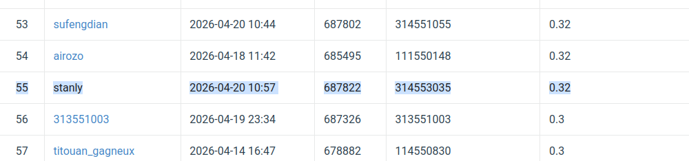
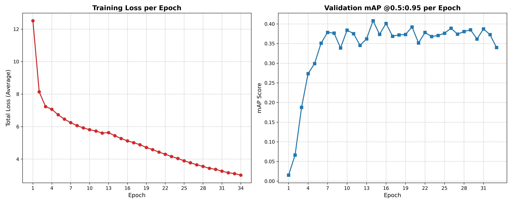
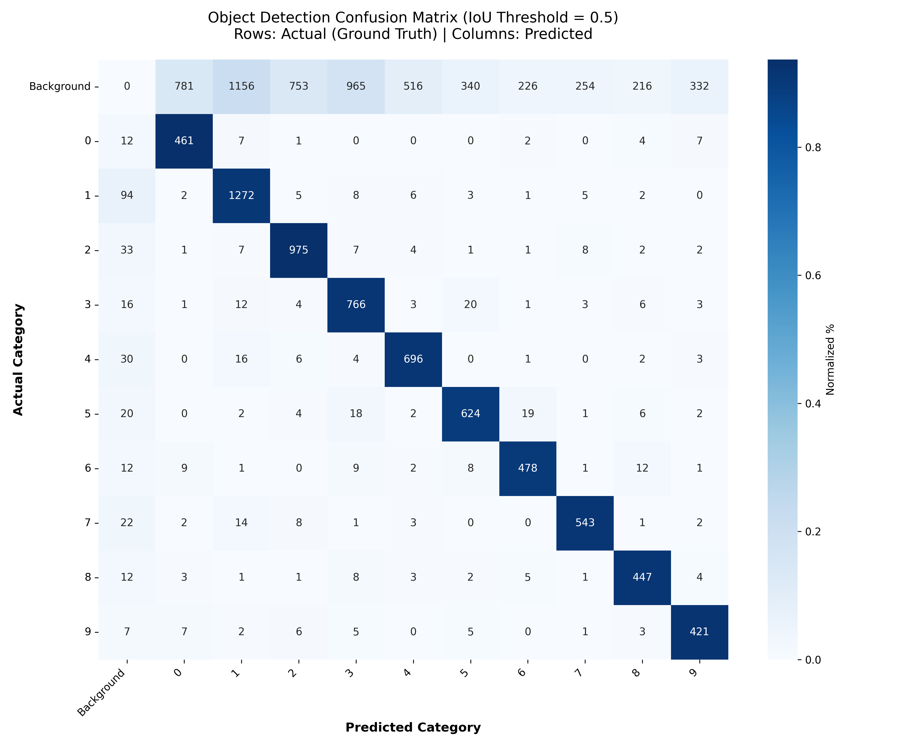

# NYCU Computer Vision 2026 - HW2 (Object Detection)

## Introduction
This repository contains the source code for Homework 2 of the NYCU Computer Vision course. The goal of this project is to build a custom **DEtection TRansformer (DETR)** pipeline for robust Object Detection.

To achieve high precision, this pipeline utilizes a pre-trained **ResNet-50** as the backbone while the Transformer Encoder, Decoder, and Hungarian Matcher are built and trained entirely from scratch. It integrates several advanced deep learning techniques:

**Custom Architecture**
Pre-Norm Transformer for stable training and Conditional Spatial Modulation for better localization:

$$
q_{\text{spatial}} = q_{\text{pos}} \odot \text{MLP}(\text{tgt})
$$

**Loss Optimization**
Bipartite Matching Loss using the Hungarian Algorithm:

$$
\mathcal{L}_{Total} = 1.0 \cdot \mathcal{L}_{ce} + 5.0 \cdot \mathcal{L}_{L1} + 2.0 \cdot \mathcal{L}_{giou}
$$

**Training Strategy**
Two-phase training pipeline (Warm-up + Fine-tuning) with Cosine Annealing Learning Rate.

**Inference Optimization**
Zero-Distortion Padding and Absolute-Coordinate Bounding Box Restoration.

## Environment Setup
Ensure you have Python 3.8+ installed. The pipeline is built using PyTorch.

**1. Install dependencies**:
```bash
pip install -r requirements.txt
```

**2. Prepare the dataset**:
Please ensure your data directory is structured as follows before running the scripts:
```text
cv_hw2_submit/
├── nycu-hw2-data/      # Dataset folder
│   ├── train/          # Training images
│   ├── valid/          # Validation images
│   ├── test/           # Test images
│   ├── train.json      # Training annotations
│   └── valid.json      # Validation annotations
├── checkpoints/        # Auto-generated (Phase 1 weights)
├── checkpoints_phase2/ # Auto-generated (Phase 2 weights)
├── model.py            # Custom DETR Architecture
├── train.py            # Phase 1 Training script
├── train_phase2.py     # Phase 2 Fine-tuning script
├── inference.py        # Prediction & inference script
```

## Usage

The project is modularized into three main scripts for phase 1 training, phase 2 fine-tuning, and inference.

### 1. Training the Model (Phase 1)
To start training the DETR model from scratch, run:
```bash
python train.py --data_dir ./nycu-hw2-data --epochs 50 --batch_size 4
```
* **What it does**: This script trains the model using AdamW and StepLR. It allows the Hungarian Matcher to overcome the initial chaos and localize objects roughly.
* **Output**: The best model weights will be saved as `checkpoints/best_model.pth`.

### 2. Fine-Tuning the Model (Phase 2)
To push the mAP to its absolute limit, run the fine-tuning phase:
```bash
python train_phase2.py --data_dir ./nycu-hw2-data --checkpoint ./checkpoints/best_model.pth --epochs 15 --batch_size 8
```
* **What it does**: Loads the best Phase 1 model and slowly refines the bounding box coordinates using a smaller learning rate and `CosineAnnealingLR`.
* **Output**: The highly refined weights will be saved as `checkpoints_phase2/best_model_phase2.pth`.

### 3. Generating Predictions
Once training is complete, generate the submission file by running:
```bash
python inference.py --data_dir ./nycu-hw2-data --checkpoint ./checkpoints_phase2/best_model_phase2.pth
```
* **What it does**: Performs zero-distortion padding inference, filters predictions with a strictly aligned `0.01` confidence threshold, and perfectly sorts the outputs.
* **Output**: A `pred.json` file will be generated, ready for leaderboard submission.

## Performance Snapshot

* **Model Architecture**: ResNet-50 Backbone + Custom Conditional DETR
* **Matching Algorithm**: Bipartite Matching (Hungarian Algorithm)
* **Key Techniques**: Pre-Norm + Spatial Modulation + Zero-Distortion BBox Restoration

### Training Curve
The graph below demonstrates the Phase 1 & 2 loss reduction and mAP improvement over the epochs. 


### Confusion Matrix
The confusion matrix highlights the model's robustness in classification.Even though the outcome wasn't great :( . Give me gpu resource please.

